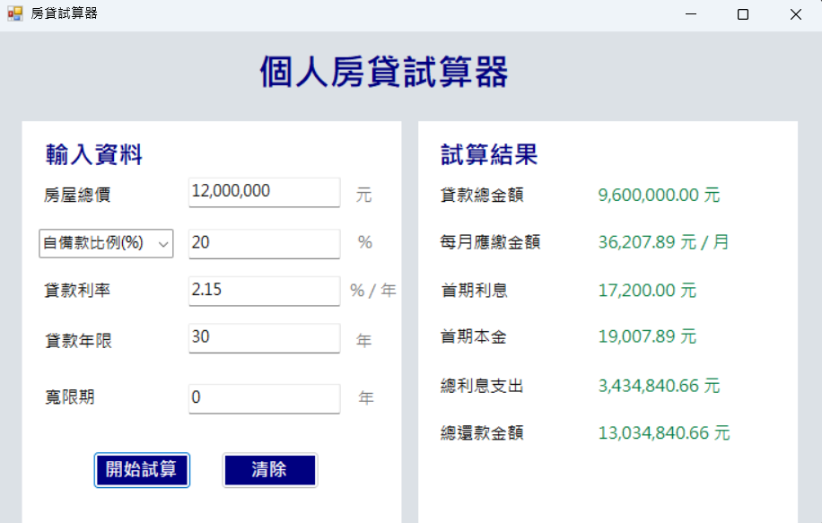

# BMI計算機

視窗程式設計 (II) 作業一

## 功能介紹
- 輸入房屋總價（支援千分位格式）
- 自備款支援「比例 / 金額」切換
- 設定貸款利率、貸款年限與寬限期
- 自動計算貸款金額
- 計算每月應繳金額
- 顯示首期利息與首期本金
- 計算總利息與總還款金額
- 提供清除按鈕重置所有欄位

## 使用方式
輸入相關資料後，點擊「開始試算」即可顯示：
- 貸款總金額
- 每月應繳金額
- 首期利息與本金
- 總利息支出
- 總利息支出
- 可使用「清除」按鈕重置所有輸入與結果

## 計算公式
### 1. 貸款金額計算
- 若選擇自備款比例：  
  貸款金額 = 房屋總價 × (1 - 自備款比例)
- 若選擇自備款金額：  
  貸款金額 = 房屋總價 - 自備款金額

---

### 2. 每月應繳金額
M = P × r × (1 + r)^n / ((1 + r)^n - 1)

- P：貸款本金  
- r：月利率（年利率 ÷ 12）  
- n：總期數（月）  

---

### 3. 首期利息與本金
- 首期利息 = 貸款本金 × 月利率  
- 首期本金 = 每月應繳金額 - 首期利息  

---

### 4. 總還款與總利息
- 總還款 = 每月應繳金額 × 總期數  
- 總利息 = 總還款 - 貸款本金 

## 執行畫面

## 開發環境
- C#
- Windows Forms
- Visual Studio

## 備註
- 房價與自備款支援輸入千分位（例如：12,000,000）
- 自備款可選擇「比例 (%)」或「金額 (元)」
- 已加入輸入驗證（避免非數字與錯誤輸入）
- 寬限期需介於 0 至貸款年限之間